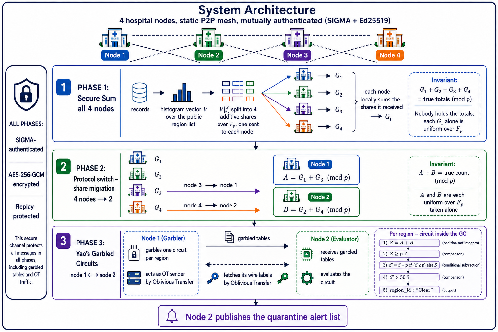

# Privacy-Preserving COVID-19 Regional Quarantine Alert System

### A hybrid Secure Multi-Party Computation system, built from scratch

**Confidential Computing, Final Project Report**

**Team:** Rotem Lev Lehman · Eli Ben Shimol · Danel Boikis · Lidor Tubul

---

## Abstract

Four independent hospital networks need to publish the list of geographic regions
where the *combined* number of COVID-19 cases exceeds a quarantine threshold of
50, without pooling patient data, and without revealing anything at all about
regions that stay below the threshold. A region with 0 cases and a region with 49
cases must be indistinguishable in the output.

We implemented a complete, working system for this. It combines two Secure
Multi-Party Computation primitives, chosen so that each does the part of the work
it is efficient at:

* **Additive secret sharing over a finite field 𝔽ₚ**, across all four nodes, for
  the linear work (summing case counts per region);
* **Yao's Garbled Circuits with Oblivious Transfer**, between two nodes, for the
  non-linear work (the threshold comparison and the conditional disclosure).

Everything cryptographic in this project was implemented from scratch. The
garbled-circuit construction, the free-XOR and point-and-permute optimisations,
the Chou–Orlandi Oblivious Transfer, the boolean circuit compiler, the additive
secret sharing, the SIGMA authenticated key exchange, and the authenticated
encrypted transport are all our own code. No SMPC framework is used. The single
runtime dependency, `cryptography`, supplies only standard primitives around the
protocol (Ed25519, X25519, HKDF, AES-GCM); the secure computation itself is built
on `hashlib`, `secrets` and `socket`.

The design problem that took the most work sits on the seam between the two
primitives: the sum is correct modulo p, but the comparison needs it over the
integers, and resolving the difference is itself a secure comparison. We solved
it by moving the modular reduction inside the garbled circuit, which kept the
first two phases information-theoretically private and cut public-key work by
57% (§5).

The system runs end to end: four node processes, real sockets, mutually
authenticated and encrypted links, and a published alert list that we verify
against ground truth. 156 automated tests cover it, including the full
four-process pipeline and a suite of adversarial transport tests.

---

## Table of contents

1. [Problem and requirements](#1-problem-and-requirements)
2. [Why this architecture](#2-why-this-architecture)
3. [System architecture](#3-system-architecture)
4. [Cryptographic construction](#4-cryptographic-construction)
5. [The central technical problem: modular reconstruction](#5-the-central-technical-problem-modular-reconstruction)
6. [Security analysis](#6-security-analysis)
7. [Security considerations: the full list](#7-security-considerations-the-full-list)
8. [Engineering decisions](#8-engineering-decisions)
9. [Experimental evaluation](#9-experimental-evaluation)
10. [Verification and testing](#10-verification-and-testing)
11. [Limitations and future work](#11-limitations-and-future-work)
12. [Conclusion](#12-conclusion)
13. [Appendices](#appendix-a--how-to-run)

---

## 1. Problem and requirements

During an active outbreak, four independent hospital networks each hold patient
diagnostic records tagged with the patient's region. Public health officials need
to know which regions have crossed a quarantine threshold (**more than 50 total
cases**) so localised lockdowns can be enforced.

### Privacy requirements

| # | Requirement | How it is met |
|---|---|---|
| R1 | **No centralised pooling.** Health-privacy law (HIPAA/GDPR) forbids merging raw patient data. | No node ever sees another node's records or counts. Data leaves a node only as uniformly random field elements. |
| R2 | **Zero leakage on sub-threshold regions.** If a region has ≤ 50 total cases, its count must remain completely hidden, 0 cases and 49 cases must be indistinguishable. | The circuit's only output for such a region is the constant `Clear`. The count is never reconstructed anywhere, in any form. |
| R3 | **Anonymised scaling.** Per-hospital patient volumes must not be revealed. | Each hospital's local vector is secret-shared before it leaves the machine; no per-hospital quantity is ever reconstructed. |

### Correctness requirement

The published alert list must be exactly the set of regions whose true combined
count exceeds 50, with the boundary handled precisely (50 → clear, 51 →
quarantine), no approximation, and no noise.

This last point is worth stating plainly because it rules out an entire family of
cheaper approaches: we need an exact answer with cryptographic privacy,
not a statistical estimate.

---

## 2. Why this architecture

We evaluated four paradigms before committing.

| Approach | Trust assumption | Privacy | Overhead | Verdict |
|---|---|---|---|---|
| **Centralised TEE** (Intel SGX) | Trust the CPU vendor and the enclave's hardware security | High, but hardware-rooted | Low, near-native speed | Rejected: a decade of side-channel attacks on SGX (Foreshadow, SGAxe, Plundervolt), and four independent hospital networks would each have to run the same vendor's hardware and trust the same attestation service. |
| **Fully Homomorphic Encryption** | Lattice hardness | High | Very high, non-linear comparison circuits are the FHE worst case | Rejected: the arithmetic schemes (BGV, BFV, CKKS) evaluate comparisons very poorly. TFHE is built for boolean gates and does better, but still runs orders of magnitude behind a garbled circuit for a function this small. |
| **Differential Privacy** | Trust the aggregator to add noise honestly | Statistical only; introduces error | Very low | Rejected: **violates the correctness requirement.** Noise means a region at 51 cases can report clear, and one at 49 can trigger a lockdown. Unacceptable for a public health decision. |
| **Hybrid SMPC** (secret sharing + Yao's GC) | Non-collusion among the computing nodes | Cryptographic and exact | Medium, fast linear phase, bounded 2PC phase | **Chosen.** Exact results, no trusted hardware, no trusted aggregator, and the expensive machinery is used only where it is needed. |

### Why *hybrid*, specifically

Garbling means encrypting a boolean circuit gate by gate, so that one party can
evaluate it on data it cannot read. Every wire carries two random labels
standing for 0 and 1, and each gate becomes an encrypted truth table that only
opens for the right pair of input labels. The cost is paid per gate, which is
why what goes inside the circuit matters so much.

A single-primitive design would be wasteful in both directions:

* Doing everything in a garbled circuit means garbling the entire summation
  across four parties, an enormous circuit, for work that additive sharing does
  in a single local addition with *zero* communication.
* Doing everything in additive secret sharing cannot work: comparison is
  non-linear, and additive sharing over 𝔽ₚ is only homomorphic for addition.
  Multiplication on shares is possible, via Beaver triples or the BGW protocol,
  and that makes the scheme complete for any function. But a comparison
  expressed that way needs the values decomposed into bits first, and the
  resulting protocol costs more than the circuit we build here.

So the design splits along the linear/non-linear boundary. Summation, the bulk
of the data, is handled by information-theoretically secure secret sharing at
essentially no cost. Only the comparison, one small circuit per region on two
scalars, is paid for with public-key cryptography. This is the core architectural
insight of the project, and it is what makes the system practical.

---

## 3. System architecture



*Four hospital nodes in a static P2P mesh, mutually authenticated with SIGMA over
per-node Ed25519 identities. Phase 1 secret-shares each node's histogram vector
across all four; Phase 2 consolidates the four shares into the two the garbled
circuit needs; Phase 3 evaluates the threshold between those two parties. Every
message in all three phases, garbled tables and OT values included, crosses the
same authenticated and encrypted links.*

### Sample output

```
==========================================================
  QUARANTINE ALERT  (threshold: more than 50 cases)
==========================================================
  region    72701 (id 1001)  ->  clear
  region    72703 (id 1002)  ->  QUARANTINE
  region    72704 (id 1003)  ->  clear
  ...
----------------------------------------------------------
  3 region(s) must be locked down: 72703, 72712, 72716
==========================================================
```

17 of the 20 regions came back clear, and for those the output is the same
constant whether the region had 0 cases or 49.

The counts behind those verdicts are never assembled anywhere, not on a node,
not on disk, not in a log, not in a message.

### Four nodes is the deployed instance, not a limit of the design

The architecture above is drawn, and implemented, for the four hospital
networks the proposal specifies, but nothing in the construction is tied to that
number. Additive sharing over 𝔽ₚ splits a value into any `n` shares, the local
summation is the same local addition regardless of `n`, and Phase 2 consolidates
whatever set of shares exists into the two values `A` and `B`. Phase 3 is
unchanged entirely: it always sees exactly two parties, no matter how many
contributed. So an `n`-node deployment is a matter of configuration, not of
redesign.

What *does* not scale gracefully is the communication pattern of Phase 1. The
current mesh is all-to-all: every node establishes a SIGMA-authenticated link
with every other node, sends each of them one share of its local vector, and
receives one share back from each. That is `n(n−1)` directed links, `n(n−1)`
share-vector transmissions, and, the expensive part, `n(n−1)` handshakes, each
costing a signature, a verification and a Diffie–Hellman exchange. At `n = 4`
this is twelve links and entirely negligible. At `n = 1000` it is roughly a
million, and the handshake cost alone would dominate the run long before any
cryptography relevant to the actual computation began.

The fix does not require changing the primitives, only who talks to whom.
Designate a small fixed committee of `m` computing nodes (`m ≪ n`) and let
the remaining nodes be pure input nodes. Each input node then splits its
local vector into `m` shares and sends one to each committee member, and to
nobody else. Committee member `i` receives one share vector from each of the `n`
input nodes and adds them element-wise mod p into a single vector `G_i`. That is
the same local addition it performs today, only over `n` incoming vectors
instead of 3. The invariant `Σ G_i ≡` true totals still holds because additive
shares add regardless of who generated them: each input node's `m` shares sum to
that node's own vector, so summing across all committee members sums across all
input nodes. Phase 2 then folds the `m` consolidated vectors into `A` and `B`,
and Phase 3 proceeds untouched.

The communication drops from `Θ(n²)` to `Θ(m·n)`, linear in the number of
participants once `m` is fixed. To put numbers on it: at `n = 1000` hospitals the
all-to-all mesh needs 999,000 directed links and as many handshakes, while a
committee of `m = 3` needs 3,000. The current system is the `m = n = 4` special
case, where every node happens to be both an input node and a computing node.

What changes in the code is small. `config.json` gains a list of which node ids
form the committee; `compute_local_shares` splits into `m` shares rather than
`n`, which is already a parameter; and the collector waits for `n` contributions
instead of `n-1`. Phases 2 and 3 are untouched, because Phase 2 already folds an
arbitrary set of consolidated vectors into `A` and `B`, and Phase 3 has always
seen exactly two parties.

The security consequence is worth stating rather than hiding: the non-collusion
assumption narrows. Today it applies to whichever nodes end up holding `A` and
`B`; under a committee it applies to the committee, and an input node's privacy
rests on the `m` computing nodes not pooling their shares. That is the usual
trade in client/server SMPC deployments, and `m` is the dial: larger `m` means a
weaker assumption and more traffic, smaller `m` the reverse. The information-
theoretic guarantee itself is unaffected, any proper subset of the `m` shares is
still uniform and independent of the secret.

---

## 4. Cryptographic construction

This section describes what we built. Every component below is our own
implementation.

### 4.1 Transport: SIGMA authenticated key exchange

Before any protocol traffic, each *directed* link runs a three-message SIGMA
("sign-and-MAC", Krawczyk 2003) handshake:

```
  Initiator A                                     Responder B
     │  msg1:  g^a, id_A  ──────────────────────────► │
     │  ◄──────────── msg2:  g^b, id_B, SIG_B, MAC_B  │
     │  msg3:  id_A, SIG_A, MAC_A ──────────────────► │

     SIG_X = Sign_X(label_X ‖ g^a ‖ g^b)          (Ed25519)
     MAC_X = HMAC(mac_key, "id" ‖ id_X)
     mac_key, session_key = HKDF-SHA512(g^ab, info = label ‖ g^a ‖ g^b)
```

Design points, each deliberate:

* **Per-node identity keys, no shared secret.** Every node holds its own Ed25519
  private key; the public keys are in the public config. A valid signature proves
  *which* node is on the other end, not just that it belongs to a group. An
  earlier design used a group pre-shared key, and we replaced it because a group
  secret lets any member impersonate any other. `test_impersonation_rejected`
  runs the handshake with node 3 signing while claiming to be node 1: the
  signature fails against node 1's public key and the handshake aborts, where
  under a group PSK the same message would have been accepted.
* **Ephemeral X25519 ⇒ forward secrecy.** Compromising a long-term signing key
  later does not decrypt past sessions.
* **Distinct signature labels per direction** (`SIGMA-initiator` /
  `SIGMA-responder`), so a recorded message from one direction can never be
  replayed as the other, a reflection attack.
* **The MAC binds identity to *this* session**, which is what prevents identity
  misbinding, the "MAC" half of sign-and-MAC.
* **HKDF-SHA512, not raw HMAC.** The X25519 output is uniform over a curve, not
  over bit strings, so extract-then-expand is the correct construction. Both
  derived keys are bound to the transcript.
* **Every hash sits inside a construction designed for it.** Key derivation is
  HKDF (extract-then-expand), message authentication is HMAC. Neither is built
  by concatenation: `H(key ‖ msg)` is vulnerable to length extension, and a bare
  digest is the wrong tool for deriving keys from a curve point. SHA-512 is the
  underlying hash throughout, which keeps the margin wider than the 256-bit keys
  and Ed25519 identities it protects.

### 4.2 Transport: authenticated encryption with replay protection

Every application message is AES-256-GCM under the session key. Two design
choices beyond "just encrypt it":

* **Counter nonces.** The nonce is the message sequence number, not a random
  value. Each direction of each link has its own key (initiator and responder run
  separate handshakes), and each key starts its counter at 0, so a nonce is never
  reused under a key, the one thing that catastrophically breaks GCM.
* **Associated data binds `sender → receiver # seq`.** The sequence number is
  never transmitted; both sides derive it from their own counters. A captured
  message re-injected later, reordered, reflected, or replayed onto a different
  link therefore authenticates against the wrong value and fails.

Because both counters advance in lockstep, the scheme depends on the transport
delivering every message exactly once and in order. TCP provides that, and the
dependency is deliberate: over a lossy datagram transport the counters would
drift apart on the first lost message and everything after it would fail to
authenticate.

Without this, an attacker who cannot forge a message could still replay a
captured share vector, and a duplicate contribution silently corrupts the secure
sum. This is defended, and tested (`test_replay_at_a_different_position_is_rejected`).

### 4.3 Phase 1: additive secret sharing over 𝔽ₚ

A value `v` is split into `n` shares drawn so that `Σ shares ≡ v (mod p)`:
`n−1` shares uniformly at random from `[0, p)`, and the last closing the sum.

* **Information-theoretic security.** Any proper subset of the shares is
  uniformly distributed and *independent of the secret*. This holds against an
  adversary with unbounded computing power, not just a bounded one.
* **CSPRNG, not `random`.** Shares are generated with `secrets`. Python's
  `random` is a Mersenne Twister whose internal state can be recovered from
  observed output, which would let a curious node reconstruct the shares sent to
  others and break secrecy outright. This is a real, exploitable distinction, not
  a stylistic one.
* **Homomorphic summation.** Because additive shares add, each node computes its
  part of the global vector with a purely local addition, no communication at
  all. This is what makes the linear phase nearly free.

### 4.4 Phase 2: share migration

Nodes 3 and 4 send their Phase 1 shares to nodes 1 and 2, which consolidate:
`A = G₁ + G₃`, `B = G₂ + G₄` (mod p).

The proposal describes this step as nodes 3 and 4 "masking" their shares before
migration. We observed that no additional masking is needed: a Phase 1 share
is *already* uniform over 𝔽ₚ, which is the entire point of additive secret
sharing. Node 1 learns a uniformly random field element and nothing else. The
privacy of this phase is therefore information-theoretic, inherited unchanged
from Phase 1.

### 4.5 Phase 3: the boolean circuit

We wrote a small circuit compiler that emits the threshold circuit directly as a
gate netlist over two primitives, `XOR` and `AND`. `NOT a` compiles to
`a XOR 1`; `a OR b` compiles to `a XOR b XOR (a AND b)`. The structure:

```
   A bits ──┐
            ├──► ripple-carry adder ──► S = A + B   (bit_length+1 bits)
   B bits ──┘
                          │
                          ▼
              conditional subtraction:  S ≥ p ? S − p : S      ◄── see §5
                          │
                          ▼
              comparator against the public threshold
                          │
                          ▼
              multiplexer:  crossed ? region_id : Clear
```

Every sub-block is hand-built:

* **Ripple-carry adder**, full adder per bit, carry chain.
* **Constant adder** (`_add_const`), because one operand is a public constant,
  each bit position needs at most one AND gate (`carry AND x` or
  `carry OR x`) instead of a full adder's three. Adding the two's complement
  `2^k − p` and discarding the final carry gives subtraction.
* **Constant comparator** (`_greater_than_const`), scans bits
  most-significant-first with two running wires, `eq` and `gt`. Because the
  threshold is public, each step costs a couple of gates on the secret bit
  instead of a full magnitude comparator.
* **Bitwise multiplexer**, `c XOR (sel AND (r XOR c))`, one AND per output bit.

Measured circuit size for the deployed parameters (20-bit shares, `p = 2²⁰−3`):

Only two of these columns drive cost. AND gates each need a 4-row garbled table
sent over the wire, while XOR gates are free under free-XOR and cost nothing at
all; and the evaluator input bit count sets how many Oblivious Transfers run,
which is the only public-key work in the protocol.

| | wires | gates | AND | XOR | evaluator input bits |
|---|---|---|---|---|---|
| deployed circuit | 489 | 427 | **195** | 232 | **20** |

The AND count is what matters: XOR gates are free under free-XOR, and the
evaluator input-bit count drives the number of public-key operations.

### 4.6 Phase 3: the garbling scheme

Each wire carries two 128-bit labels. We implemented both standard
optimisations, and they are what make the circuit cheap enough to be practical:

* **Free-XOR.** A single global secret offset `R` (with `lsb(R) = 1`) is fixed
  per circuit, and every wire satisfies `label₁ = label₀ ⊕ R`. An XOR gate then
  needs no garbled table at all, the evaluator just XORs the two labels it
  already holds. Roughly half our gates are XOR, so this is a large saving.
* **Point-and-permute.** The least-significant bit of a label is its public
  *select bit*. Because `lsb(R) = 1`, a wire's two labels have complementary
  select bits, so the evaluator indexes directly into the 4-row AND table and
  decrypts exactly one row, without learning the underlying truth value.

Row encryption is `H(gate_id, W_a, W_b) ⊕ out_label`, with `H` a SHA-512-based
tweakable hash keyed by a per-gate id, so identical input labels in different
gates produce independent masks.

Free-XOR is not free of assumptions. Because every wire pair differs by the same
global `R`, the hash must remain secure on correlated inputs, which is a stronger
requirement than a plain random oracle and is known as circular correlation
robustness (Choi et al., 2012). We note it rather than claiming the weaker
standard assumption covers it.

Only the garbler ever knows `R` or any `label₀`. The garbled circuit sent over
the wire contains no `label₀` values and not `R`; it is indistinguishable from
random to the evaluator.

### 4.7 Phase 3: Oblivious Transfer

The evaluator must obtain the wire label matching each of its private input bits, without revealing the bit to the garbler, and without learning the other label.
We implemented the Chou–Orlandi (2015) "simplest OT" over a prime-order
subgroup of ℤ*ₚ:

```
   sender:    a ← Z_q, A = g^a                          (sent once, reused)
   receiver:  b ← Z_q, B = g^b            if c = 0
                        B = A · g^b        if c = 1       (sent to sender)
              k_c = H(i, A, B, A^b)
   sender:    k_0 = H(i, A, B, B^a)
              k_1 = H(i, A, B, (B/A)^a)
              ct_e = m_e ⊕ k_e                            (both sent back)
   receiver:  m_c = ct_c ⊕ k_c
```

**Correctness:** `A^b = g^{ab}` equals `B^a` when `c = 0` and `(B/A)^a` when
`c = 1`, so the receiver reconstructs exactly the key for its chosen bit.

**Security (semi-honest):** the sender never sees `c`, because `B` is uniform in
the subgroup either way; and the receiver cannot form the other key without
`g^{ab}` for the unchosen branch, the Computational Diffie–Hellman assumption.

We hash the full transcript (`A` and `B`, not just the shared element) into
every key, as the paper's proof requires, and we **validate every received group
element** (`1 < X < p−1` and `X^q ≡ 1`) on both sides. Two standard MODP groups
are supported: RFC 3526 2048-bit (default, current recommended strength) and RFC
2409 1024-bit (~5× faster, explicitly weaker, for quick demos).

### 4.8 The two-party protocol

Per region, five messages:

```
   1. garbler   → evaluator : garbled tables + garbler/constant labels + decoding
   2. garbler   → evaluator : the OT sender's public key A
   3. evaluator → garbler   : the OT choice values B (encode the evaluator's bits)
   4. garbler   → evaluator : the OT ciphertexts (encrypted label pairs)
   5. evaluator → garbler   : the decoded output bits (the public result)
```

Both parties build the *same* public circuit independently from the public
parameters, so only secret-dependent garbled material crosses the wire, never
the topology. The two halves run in separate processes and each holds only
its own secret bits; even the single-process simulation mode drives garbler and
evaluator against each other over a real socket pair on separate threads, so no
call ever holds both parties' secrets.

---

## 5. The central technical problem: modular reconstruction

This was the hardest design problem in the project, it sits exactly on the seam
between the two phases, and getting it wrong is silent and catastrophic.

### The problem

Phase 1 works modulo `p`. So after Phase 2, `A + B ≡ T (mod p)` where `T` is the
true count, but over the integers, `A + B` is either `T` or `T + p`:

```
   A, B ∈ [0, p)   ⇒   A + B ∈ [0, 2p)   and   A + B ≡ T (mod p)
```

Since counts are tiny next to `p`, the wrapping case is in fact the overwhelmingly
common one. Feeding `A + B` to a naive comparator therefore compares `T + p`
against the threshold and reports every region as over the threshold, a
total failure that produces plausible-looking output.

Deciding which case holds is itself a comparison on secret data. It cannot be
done in the clear at the hand-off, because that is exactly the operation the
garbled circuit exists to perform securely.

### The approach we rejected

One workaround is to abandon the field at the boundary: re-share every node's raw
local vector as integers with a large random mask, so reconstruction is exact
and no reduction is needed. We built this version first, which is how the
boundary problem surfaced at all, and it is what let us measure the two designs
against each other in the table below rather than argue about them. We then
rejected it on two grounds:

1. **It weakens the privacy guarantee.** Integer masking is only *statistically*
   hiding (leakage ≈ `count / 2^mask_bits` per share, across `M × n` shares per
   run), where the field arithmetic it replaces is *information-theoretically*
   hiding.
2. **It makes Phase 1 decorative.** The re-sharing derives from the raw local
   vectors, so the entire secure-sum phase, one of the project's two named
   deliverables, is computed and then discarded.

### The solution: do the reduction inside the circuit

Since `A, B < p`, the integer sum is `< 2p`, so **one conditional subtraction
suffices**. We inserted it between the adder and the comparator:

```
   S = A + B                      (bit_length + 1 bits)
   over = S > p − 1               (reuses the constant comparator)
   D    = S + (2^k − p)           (constant adder = subtract p)
   S'   = over ? D : S            (bitwise multiplexer)
   crossed = S' > threshold
```

This keeps the shares in the field all the way to Phase 3. Phase 1 becomes
load-bearing, the real threshold (50) is used unchanged with no offset
arithmetic, and the privacy argument stays information-theoretic through Phases 1
and 2.

### It is also cheaper

The counter-intuitive result: adding work to the circuit made the system *faster*,
because it shrank the shares.

| | integer masking (rejected) | mod-p in circuit (deployed) |
|---|---|---|
| share width | 47 bits | **20 bits** |
| base OTs per region | 47 | **20** |
| AND gates | 287 | **195** |
| privacy of Phases 1–2 | statistical | **information-theoretic** |

The OT count is the dominant cost, one modular exponentiation per evaluator
input bit, so a 2.35× reduction in public-key operations comes along with
the stronger guarantee. Both branches of the conditional subtraction are tested
explicitly, with share pairs constructed to force each (`test_modulus.py`);
random sampling would have exercised only the wrapping branch.

---

## 6. Security analysis

### 6.1 Threat model

The same code runs in two settings, and some properties differ because the
*environment* differs, not because the protocol does. We state both, so that
nothing is claimed that the deployment does not support.

| | **Demo** (single machine) | **Production** (per the proposal) |
|---|---|---|
| Deployment | 4 processes, one machine, one operator | 4 hospital networks, separate machines |
| Participants | honest-but-curious | honest-but-curious |
| Network | loopback, trusted | **untrusted**, this is why SIGMA + AES-GCM exist |
| Console | one shared terminal | four separate consoles, four organisations |
| Local disk | one shared filesystem | four separate filesystems |

**Adversaries we defend against:**

* **Honest-but-curious participants** (per the proposal): nodes follow the
  protocol faithfully but try to learn whatever they can from their inputs, the
  messages they receive, and their logs.
* **An active network adversary**: can observe, drop, reorder, duplicate, and
  inject traffic, and can connect to any node's port. In production the links
  between hospitals cross untrusted infrastructure, so this is in scope.

**Assumed:** non-collusion between the two 2PC parties. Node 1 and Node 2 must
not pool `A` and `B`; together those reconstruct every count. This is the standard
assumption for 2PC and matches the proposal's non-collusion requirement.

**Out of scope:** malicious (protocol-deviating) participants; compromised
endpoints; traffic analysis (message sizes and timings are functions of the
public parameters only); availability (a node that refuses to participate stops
the computation, the proposal fixes the topology and excludes failure handling).

### 6.2 What each phase hides, and from whom

| Phase | Guarantee | Strength | What a participant sees |
|---|---|---|---|
| **1, Secure Sum** | No node learns another's local counts | **Information-theoretic** | Three uniformly random vectors over 𝔽ₚ, plus its own data |
| **2, Migration** | Neither party learns anything about the counts | **Information-theoretic** | One uniformly random field element per region |
| **3, Garbled Circuit** | Sub-threshold counts never revealed | Computational (circular correlation robustness for free-XOR, CDH for OT) | Garbled tables, random-looking labels, OT ciphertexts |
| **Output** | Only the alert list is public |, | `region_id` or `Clear` per region |

The Global Region Vector is never assembled at any point in the protocol. It
exists only as four shares held by four nodes, then as two shares held by two
parties, and then only inside a garbled circuit as encrypted wire labels.

### 6.3 What the output deliberately reveals

The published result is `Clear` at a public region index. So the output *does*
reveal which regions are below the threshold, but never by how much. A region
with 0 cases and one with 49 produce byte-identical transcripts, which is exactly
requirement R2.

Revealing *that* a region is clear is inherent in the proposal's own output
formula (`Need Quarantine ? Region ID : "Clear"`) and is arguably required 
officials need to know which regions were assessed. A stricter variant would
shuffle the region order or pad the output set; we note it as future work rather
than leaving the property implicit.

### 6.4 Transport security summary

| Property | Mechanism |
|---|---|
| Peer authentication | SIGMA sign-and-MAC, per-node Ed25519 identity keys |
| Key agreement | Ephemeral X25519, HKDF-SHA512, transcript-bound |
| Forward secrecy | DH keys discarded after the handshake |
| Confidentiality + integrity | AES-256-GCM per directed link |
| Replay / reorder resistance | Counter nonces + `sender→receiver#seq` as AAD, never transmitted. Relies on TCP's in-order, exactly-once delivery (§4.2) |
| Sender attribution | Messages carry the SIGMA-**authenticated** id, not a self-declared field |
| Memory-exhaustion resistance | Length-prefixed frames, 8 MiB cap checked **before** allocation |
| Liveness | Socket and collection timeouts; a dead peer raises, never hangs |
| Session hygiene | One inbound session per peer; self-connections refused; connection cap |

These mechanisms are what the production column of §6.1 requires. The demo runs
them too, over loopback, because it is the same code path; switching them off for
a local run would mean the demo no longer exercises what gets deployed.

This covers all three phases. Phase 3's garbled tables and OT values travel
over the same protected links as Phase 1 and Phase 2 traffic, because the 2PC
engine takes its transport as a parameter.

### 6.5 Residual risks, stated explicitly

Under a malicious (rather than semi-honest) party, outside the proposal's
model, but worth naming rather than leaving implicit:

* A malicious garbler could garble a circuit other than the agreed one; the
  evaluator cannot check. Defending this requires cut-and-choose or authenticated
  garbling.
* A malicious evaluator could report a false output in message 5.

Neither is defended. Both are out of model. Both are documented.

---

## 7. Security considerations: the full list

Every security decision we made, in one place. Items marked beyond model are
not required by the proposal's semi-honest assumption; we implemented them anyway,
because they are cheap and a security claim is worth more when it does not rest on
a single assumption.

### Summary by category

| Category | Items | Representative decisions |
|---|---|---|
| Key management and identity | 4 | Per-node Ed25519 keys rather than a group PSK; private keys mode 0600 and gitignored |
| Key exchange | 7 | Identity misbinding blocked by the MAC over the signer's id; distinct labels per direction; HKDF-SHA512 extract-then-expand |
| Channel | 9 | Counter nonces make nonce reuse structurally impossible; the sequence number lives in the AAD and never on the wire; the key width is checked so a short key cannot silently downgrade AES-256 to AES-128 |
| Protocol integrity | 4 | Collectors require one contribution per authenticated peer, not a message count; every message carries a phase tag and is re-offered rather than dropped |
| Secret sharing | 5 | `secrets` rather than `random`; p validated prime and large enough that the global sum cannot wrap; `vectorize` raises on an oversized count instead of reducing it |
| Garbled circuits and OT | 7 | Group-element validation on both sides of the OT; per-gate keyed hash; the transcript carries no `label₀` and no `R` |
| Operational | 5 | Keys, share dumps and generated data gitignored; share vectors held in memory by default, the disk dump opt-in and mode 0600 |
| Deliberate demo trade-offs | 2 | One console and one filesystem in the demo, both absent in production, both off by default |

The full table, all 43 items with the reasoning for each, is in Appendix D.

## 8. Engineering decisions

### 8.1 We evaluated MPyC as a second engine, and removed it

To compare our implementation against an established framework, we built a
pluggable backend interface and added [MPyC](https://github.com/lschoe/mpyc) as a
second engine. We evaluated it, found it unsuitable, and removed it. Two
reasons, in order of importance:

1. **MPyC does not implement Yao's Garbled Circuits.** It is *honest-majority
   Shamir secret sharing* over arithmetic circuits, a different primitive
   entirely. Benchmarking it against our engine compares two unrelated
   techniques, which is not the comparison this project is about.

2. **In the two-party setting it provides no input privacy at all.**
   Honest-majority Shamir requires `t < m/2`. With `m = 2` parties MPyC runs at
   threshold `t = 0`, and a degree-0 sharing polynomial is the constant
   `f(X) = secret`, so the "share" is the secret. We confirmed this
   experimentally before dropping it: **party 1 read party 0's private input
   verbatim from its own share.** Yao's protocol is what the proposal specifies
   because it is secure for two parties.

MPyC would be a sound choice for a *different* architecture: one 4-party session
across all four hospitals, skipping the reduction to two parties entirely, where
`t = 1` and no single hospital learns anything. That is a legitimate alternative
design, but it is not a drop-in engine for this proposal's hybrid pipeline.

A further practical problem: MPyC brings its own networking with no hook to
substitute ours, so it opened a second, unprotected connection outside our
authenticated channel, meaning its traffic would not have had any of the
protections in §6.4.

With one engine remaining, the backend abstraction and its registry were pure
indirection, so they were removed too.

### 8.2 The transport seam we kept

One abstraction earned its place: the `Channel` contract (`send` / `recv` /
`close`). The 2PC engine never touches sockets directly, so the same crypto code
runs over a bare socket in tests and over the SIGMA-authenticated, AES-GCM
encrypted mesh in production, with no change to the cryptographic layer. This
is what lets Phase 3 inherit every transport guarantee in §6.4.

### 8.3 Division of work

The project was split along the interface boundary so both halves could be
developed, mocked and tested independently:

* **Workstream A, Networking & Secure Summation:** the P2P mesh, the SIGMA
  handshake and encrypted transport, vectorisation, additive sharing, the secure
  sum, and share migration.
* **Workstream B, Garbled Circuits & Logic Evaluation:** the boolean circuit,
  the garbling scheme, Oblivious Transfer, and the two-party protocol.

They meet at exactly two seams, both covered by dedicated tests: the
`ThresholdProblem` hand-off (the `A`/`B` interface) and the `Channel` transport
contract.

---

## 9. Experimental evaluation

Full tables in [`experiments/measurements.md`](experiments/measurements.md); raw
data in `experiments/results.json`. **Every timed measurement is a genuine
two-process 2PC session**, party 0 and party 1 as separate OS processes over
real sockets. Wall time is what a user actually waits, including process spawn
and rendezvous. Local simulation is never used for measurements.

Environment: Linux (RHEL 9.7, kernel 5.14), Python 3.10, 12 cores.

### 9.1 Correctness

All ten problem instances in `problems/`, in both OT-group configurations, reveal
exactly the expected output, checked against a stored `solution.json` per
problem. The full four-process pipeline was additionally verified against ground
truth computed from the generated records.

### 9.2 Speed

Every figure is the mean of 5 runs, with the standard deviation alongside.
Averaging matters here: a single run varies by enough that a larger input can
time faster than a smaller one, which would contradict the trend the numbers are
there to establish.

| regions (16-bit shares) | 2048-bit OT | 1024-bit OT |
|---|---|---|
| 1 | 1.93 s ± 0.01 | 0.36 s ± 0.01 |
| 2 | 3.80 s ± 0.01 | 0.68 s ± 0.00 |
| 4 | 7.55 s ± 0.00 | 1.32 s ± 0.01 |
| 8 | 15.04 s ± 0.03 | 2.60 s ± 0.01 |

| share width (4 regions) | 2048-bit OT | 1024-bit OT |
|---|---|---|
| 8 bits | 3.95 s ± 0.01 | 0.77 s ± 0.01 |
| 16 bits | 7.55 s ± 0.02 | 1.32 s ± 0.00 |
| 24 bits | 11.16 s ± 0.04 | 1.87 s ± 0.01 |
| 32 bits | 14.80 s ± 0.03 | 2.42 s ± 0.00 |

Cost grows linearly in `regions × bit_length`, as predicted: the engine runs
textbook base OT, one modular exponentiation per evaluator input bit. The
measurements show this sharply. Doubling the region count multiplies the time by
1.97, 1.99 and 1.99 across the three doublings, and every additional 8 bits of
share width adds a near-constant 3.60 s, 3.62 s and 3.64 s at 2048-bit (0.54 s,
0.56 s and 0.55 s at 1024-bit). The fixed protocol overhead, measured on the
smallest possible run, is 1.02 s at 2048-bit and 0.22 s at 1024-bit; subtracting
it gives the marginal cost of the cryptography itself.

This measured relationship is why the §5 redesign matters in practice:
narrowing shares from 47 to 20 bits removes 57% of the public-key work.

### 9.3 Communication

| configuration | garbler→evaluator | evaluator→garbler | total | per region |
|---|---|---|---|---|
| 2048-bit OT | 85,949 B | 39,941 B | 125,890 B | 31,472 B |
| 1024-bit OT | 84,714 B | 20,221 B | 104,935 B | 26,234 B |

Measured exactly on the channel (4 regions × 16 bits). Garbled tables dominate:
four 128-bit ciphertexts per AND gate. **Traffic is a function of the public
parameters only**, so it leaks nothing about the inputs, a security property, not
just a performance figure.

### 9.4 Implementation footprint

| Component | Code lines |
|---|---|
| `smpc_gc/yao/`, circuit, garbling, OT, protocol | 725 |
| `smpc_gc/threshold.py`, the per-region driver | 158 |
| `smpc_gc/`, channel, types, mock, CLI | 567 |
| Transport + secure summation (SIGMA, AEAD, mesh, sharing) | 1,478 |
| **Total production code** | **2,928** |
| Test suite | 1,503 |

Runtime dependencies: one. `cryptography`, used only for standard primitives
around the protocol. The SMPC itself is `hashlib`, `secrets` and `socket`.

---

## 10. Verification and testing

156 automated tests. The suite is structured around the properties that
matter, not just line coverage.

| Suite | What it establishes |
|---|---|
| `test_secure_sum.py` | Vectorisation, sharing round-trips, the secure sum against plaintext totals, **share uniformity** (a statistical test that shares of different secrets are indistinguishable), overflow rejection |
| `test_share_reduction.py` | Phase 2 routing, exact reconstruction, threshold verdicts preserved, boundary at exactly 50/51, **each consolidated vector alone is uniform over 𝔽ₚ** |
| `test_sigma_handshake.py` | Both sides agree; fresh key per session; **impersonation rejected**; wrong-peer rejected; tampered DH key rejected; replayed `msg2` rejected; mid-handshake identity swap rejected; unknown node rejected |
| `test_node_transport.py` | **Replay rejected**; reorder rejected; cross-link message rejected; tampered ciphertext rejected; oversized frame refused before allocation; **duplicate contribution rejected**; timeout instead of hang; unauthenticated injection ignored |
| `test_config_loader.py` | Every config invariant: primality (including a Carmichael number as a negative case), field sizing, key length/hex/uniqueness, port ranges, duplicate addresses |
| `test_yao.py` | OT in both groups; **OT group-element validation**; truncated/oversized ciphertext rejection; garbling vs plaintext; protocol desynchronisation detection; the split garbler/evaluator over a channel; a genuine two-process run |
| `test_modulus.py` | Modular reconstruction with **both wrap branches explicitly constructed**; the circuit is cheaper than integer masking; **0 cases and 49 cases produce identical output** |
| `test_gc_handoff.py` | The Phase 2→3 schema round-trips on the **real configured parameters**; file permissions; unreduced-share rejection |
| `test_gc_channel.py` | The 2PC engine running over two real SIGMA-authenticated nodes |
| `test_threshold.py` | Problem semantics, validation, JSON round-trip |
| `test_problems.py` | All ten stored problems, plus a two-process CLI run |
| `test_end_to_end.py` | **The whole system as four OS processes**, alert list vs ground truth; sub-threshold counts absent from all output; `gc_input/` absent by default and `0600` when requested |

Two results worth highlighting:

* **The test suite found a real bug.** `OTReceiver.finalize` derived its one-time
  pad at the ciphertext's own length, so a truncated ciphertext decrypted
  "successfully" into a short wire label. We fixed the code rather than relaxing
  the test.
* **The end-to-end test verifies the system as a whole.** Unit tests establish
  that each component is correct in isolation; only running the real program as
  four separate OS processes, real sockets, real handshakes, all three phases in
  sequence, establishes that the *system* is correct. It launches the pipeline
  exactly as the demo does and checks the published alert list against ground
  truth computed independently from the generated records.

---

## 11. Limitations and future work

Stated plainly rather than omitted.

| Limitation | Impact | Remedy |
|---|---|---|
| **Base OT, not OT extension** | One public-key operation per evaluator input bit, the dominant cost, linear in `regions × bit_length` | OT extension (IKNP) amortises base OTs into symmetric operations; changes performance, not the security argument |
| **Semi-honest only** | A malicious garbler could garble a different circuit; a malicious evaluator could lie about the output | Cut-and-choose or authenticated garbling |
| **Non-collusion required** between the two 2PC parties | Nodes 1 and 2 together reconstruct all counts | An `n`-party protocol with an honest majority (this is where MPyC's 4-party mode would fit) |
| **Sub-threshold regions are named** (as `Clear`) | Reveals *that* a region is clear, never its count | Shuffle region order or pad the output set |
| **Fixed topology, no failure handling** | A node that drops stops the run | Per the proposal's stated assumptions; dynamic membership is out of scope |
| **All-to-all Phase 1 mesh** | `n` nodes cost `Θ(n²)` links, handshakes and share transmissions; fine at the deployed `n = 4`, prohibitive for large `n` | A committee of `m ≪ n` computing nodes that all `n` input nodes share to, giving `Θ(m·n)` communication, see §3. Narrows the non-collusion assumption to the committee |
| **Multi-day trend detection not implemented** | `proposal.md` §4 future work, flagging regions trending upward without crossing on any single day | Requires state across runs; the circuit would compare a windowed sum |

---

## 12. Conclusion

We built a complete, working, privacy-preserving distributed system that answers
a real public-health question, *which regions must be locked down?*, while
provably revealing nothing else.

What we consider the substance of the work:

1. **A from-scratch implementation of Yao's Garbled Circuits**, with free-XOR and
   point-and-permute, plus a hand-built circuit compiler for the threshold
   function and a from-scratch Chou–Orlandi Oblivious Transfer. No SMPC library
   is involved anywhere.

2. **A from-scratch authenticated, encrypted P2P transport**: SIGMA key exchange
   with per-node Ed25519 identities, AES-256-GCM with counter nonces and
   associated data, and replay/reorder resistance, carrying *all three phases*,
   the garbled circuit included.

3. **A genuine hybrid architecture** that puts information-theoretic secret
   sharing where it is cheap and public-key cryptography only where it is
   necessary.

4. **Solving the field/integer boundary problem correctly** rather than
   sidestepping it, by moving the modular reduction inside the garbled circuit,
   which preserved information-theoretic privacy through Phases 1–2 *and* cut
   public-key work by 57%.

5. **A security posture built on enumerated decisions**, including hardening
   beyond the stated threat model, a written threat model with explicitly bounded
   demo trade-offs, and a test suite that verifies the adversarial properties 
   not merely the happy path.

The guarantees, and where each comes from:

| Claim | Strength | Rests on |
|---|---|---|
| No node learns another's local counts | **Information-theoretic** | Additive secret sharing over 𝔽ₚ |
| No node learns the global per-region totals | **Information-theoretic** | Shares never combined outside the circuit |
| Sub-threshold counts never revealed | Computational | Yao's GC + OT (RO model, CDH) |
| Only the two designated parties can run Phase 3 | Computational | SIGMA authentication, Ed25519 |
| Traffic cannot be read, forged, or replayed | Computational | AES-256-GCM, counter nonces, AAD |
| Results are exact and correct | **Verified** | 156 tests, incl. the full 4-process pipeline vs ground truth |

---

## Appendix A, How to run

```bash
uv sync --extra dev          # install (one dependency: cryptography)
./run_all.sh                 # generate a demo scenario, run all 4 nodes
uv run pytest                # 156 tests
```

`run_all.sh` calls `src/demo_setup.py` on first use to generate per-node identity
keys, write the matching public keys into `config.json`, and synthesise hospital
records with counts deliberately straddling the threshold.

```bash
./run_all.sh --ot-group 1024        # ~5x faster, weaker group, for a quick demo
./run_all.sh --show-shares          # also print each node's raw share
./run_all.sh --seed 7               # a different scenario
uv run smpc-gc                      # the 2PC threshold layer on its own
uv run python experiments/run_experiments.py    # regenerate the measurements
```

## Appendix B, Where the code lives

```
src/
  main.py                     per-node entry point; runs all three phases
  demo_setup.py, keygen.py    identity keys + demo scenario
  config_loader.py            public config + strict validation
  sigma_handshake.py          SIGMA AKE, per-node Ed25519 identities  [transport]
  secure_channel.py           AES-256-GCM, counter nonces, AAD        [transport]
  node.py                     P2P mesh, framing, authenticated delivery
  vectorize.py                records -> histogram vector             [phase 1]
  secret_sharing.py           additive sharing over F_p               [phase 1]
  secure_sum.py               the distributed secure sum              [phase 1]
  share_reduction.py          4 nodes -> 2 parties                    [phase 2]
  gc_handoff.py               the Phase 2 -> Phase 3 boundary         [phase 2/3]
  gc_channel.py               adapter: run the GC over our transport  [phase 3]
  smpc_gc/
    yao/circuit.py            the threshold circuit (adder, mod-p, comparator, mux)
    yao/garbling.py           free-XOR + point-and-permute garbling
    yao/ot.py                 Chou-Orlandi 1-out-of-2 Oblivious Transfer
    yao/protocol.py           the Garbler / Evaluator halves
    threshold.py              evaluate_threshold(): one circuit per region
    channel.py, types.py      transport contract; the A/B interface boundary
    mock.py, cli.py           mock/JSON problems; the `smpc-gc` command

config.json                   public config (regions, field, node addresses)
problems/                     ten problem instances + expected solutions
tests/                        156 tests
experiments/                  measurement harness -> measurements.md
```

## Appendix C, Companion documents

| Document | Contents |
|---|---|
| [`proposal.md`](proposal.md) | The original project proposal |
| [`division.md`](division.md) | How the work was split between the two workstreams |
| [`THREAT_MODEL.md`](THREAT_MODEL.md) | The threat model in full, with per-phase guarantees and parameter justifications |
| [`REVIEW.md`](REVIEW.md) | The internal security and code review conducted on the merged system, and the remediation plan we executed |
| [`experiments/measurements.md`](experiments/measurements.md) | Generated measurement tables |
| [`README.md`](README.md) | Developer-facing overview |

## Appendix D, Security considerations, in full

Every security decision, one row each. Items marked *beyond model* are not
required by the proposal's semi-honest assumption; we implemented them anyway.
### Key management and identity

| # | Consideration | Decision |
|---|---|---|
| 1 | Group PSK vs per-node identity | **Per-node Ed25519 keys.** A group secret lets any member impersonate any other; a per-node key proves *which* node is speaking. |
| 2 | Private key storage | Written mode `0600`, in a gitignored directory. Never committed; the shipped config carries placeholder public keys whose private halves nobody holds. |
| 3 | Public key distribution | Public config, validated at load: exact hex length, valid hex, and **no two nodes sharing a key**. |
| 4 | Key compromise window | Ephemeral X25519 per session ⇒ forward secrecy; a leaked long-term key does not decrypt past traffic. |

### Key exchange

| # | Consideration | Decision |
|---|---|---|
| 5 | Identity misbinding | SIGMA's MAC over the signer's identity, keyed from the DH secret, binds identity to the session. |
| 6 | Reflection attack | Distinct signature labels per direction. |
| 7 | Replay of handshake messages | Fresh ephemeral keys per session; a recorded `msg2`/`msg3` fails against the new transcript. Tested. |
| 8 | Wrong-peer detection | The initiator aborts if the responder's claimed id ≠ the node it dialled. Tested. |
| 9 | Mid-handshake identity swap | The responder rejects an id in `msg3` that differs from `msg1`. Tested. |
| 10 | Unknown peer | A node with no configured public key cannot authenticate. Tested. |
| 11 | Key derivation | HKDF-SHA512 extract-then-expand over the raw X25519 output, both keys transcript-bound, not an ad-hoc HMAC. |

### Channel

| # | Consideration | Decision |
|---|---|---|
| 12 | Confidentiality + integrity | AES-256-GCM; tampering is detected. Tested. |
| 13 | Nonce reuse | Counter nonces under per-direction keys, structurally impossible to repeat. |
| 14 | **Message replay** | Sequence number in the AAD, never transmitted, so it cannot be renumbered. Tested. |
| 15 | Reordering | Same mechanism: a message only authenticates at its exact position. |
| 16 | Cross-link / reflected messages | AAD binds `sender → receiver`. Tested. |
| 17 | Memory-exhaustion DoS | Length-prefixed framing with an 8 MiB cap checked *before* allocation, on the pre-authentication path. Tested. |
| 18 | Hang on peer death | Socket timeouts and collection timeouts throughout; failures log and close rather than killing a thread silently. Tested. |
| 19 | Connection flooding | One inbound session per peer, self-connections refused, concurrent-connection cap. |
| 20 | Silent cipher downgrade | `AESGCM` accepts 16- and 24-byte keys as well as 32, so a shortened KDF output would quietly run AES-128 while the design says AES-256. The channel rejects any key that is not 32 bytes. |

### Protocol integrity

| # | Consideration | Decision |
|---|---|---|
| 21 | **Sender attribution** *(beyond model)* | The inbox carries the SIGMA-authenticated id. Collectors require exactly one contribution per expected peer, a real per-peer rule, not a message count. |
| 22 | Duplicate contributions *(beyond model)* | Rejected explicitly, so a deviating node cannot displace another's data. Tested. |
| 23 | Phase confusion | Every message carries an explicit phase tag; a message for another phase is held aside and re-offered, never dropped. (An earlier design dropped them, and deadlocked a node in a real run.) Tested. |
| 24 | Message-type confusion *(beyond model)* | Both 2PC halves verify the type of every message received rather than reading a missing key as `None`. Tested. |

### Secret sharing

| # | Consideration | Decision |
|---|---|---|
| 25 | Randomness source | `secrets` (CSPRNG), never `random`, a recoverable PRNG state would break secrecy outright. |
| 26 | Share uniformity | Verified statistically in tests: shares of very different secrets are indistinguishable. |
| 27 | Field size | Validated at startup that `p` is **prime** (Miller–Rabin) and that `p > num_nodes × max_local_count`, so the global sum cannot wrap. |
| 28 | Silent count overflow | `vectorize` **raises** on a count too large for the field instead of reducing it, a wrapped count would turn an outbreak into a small number and report clear. |
| 29 | Information-theoretic vs statistical hiding | Chose the field-based design specifically to keep Phases 1–2 information-theoretic (see §5). |

### Garbled circuits and OT

| # | Consideration | Decision |
|---|---|---|
| 30 | Label secrecy | The transcript contains no `label₀` and not `R`; it is indistinguishable from random to the evaluator. |
| 31 | Gate-hash independence | `H` is keyed by a per-gate id, so identical input labels in different gates give independent masks. |
| 32 | Free-XOR soundness | `lsb(R) = 1` guarantees complementary select bits, so point-and-permute leaks nothing. |
| 33 | **OT group validation** *(beyond model)* | Both parties reject elements outside the order-q subgroup, a small-order `A` would otherwise let a deviating garbler probe the choice bit. Tested. |
| 34 | **OT transcript hashing** *(beyond model)* | `A` and `B` are hashed into every key, matching the Chou–Orlandi proof, rather than the shared element alone. |
| 35 | Truncated-ciphertext handling *(beyond model)* | OT ciphertexts must be exactly one wire label wide; a short ciphertext is an error, not a short label. **This was found by a test we wrote and then fixed in the code.** Tested. |
| 36 | OT group strength | RFC 3526 2048-bit by default; the faster 1024-bit group is opt-in and documented as weaker. |

### Operational

| # | Consideration | Decision |
|---|---|---|
| 37 | Secrets in version control | `keys/`, `*.key`, `gc_input/`, `data/` gitignored; history audited to confirm no key was ever committed. |
| 38 | Secrets on disk | Any file holding a share vector or a private key is written mode `0600` in a mode-`0700` directory. |
| 39 | Share vectors on disk | The pipeline hands shares to the 2PC engine **in memory**; the disk dump is opt-in (`--gc-out`), off by default, and per-node. |
| 40 | Share values in logs | Off by default; opt-in via `--show-shares` for demonstration, with the risk documented. |
| 41 | Config validation | Ports, hosts, duplicate addresses, duplicate keys, region duplicates, node-id contiguity, all validated at startup, before any socket opens. |

### Deliberate demo trade-offs

Two properties are relaxed in the single-machine demo, by choice, and do not
exist in production. They are listed here so it is clear they were identified,
bounded, and chosen, not missed.

| # | Trade-off | Why it is bounded |
|---|---|---|
| 42 | All four nodes print to one console (`--show-shares` shows raw shares) | In production the four consoles belong to four organisations on four machines; no combined transcript exists. Showing the shares is also the clearest demonstration that a share is uniform noise. **Off by default.** |
| 43 | `--gc-out` writes both parties' share vectors on one filesystem | In production the two files are written on two different machines by two different hospitals; neither can read the other's. **Off by default**, mode `0600`, per-node directories, gitignored. |

---
